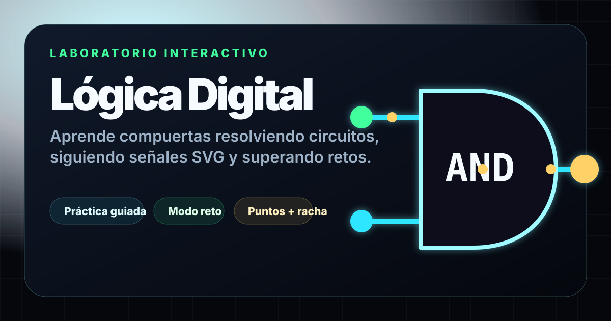
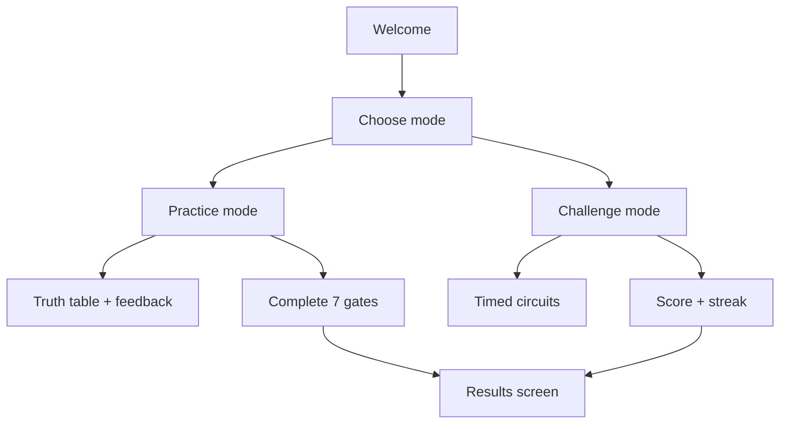

# Lógica Digital — Digital Logic Lab

<div align="center">


<br />

<a href="https://logis-gates-challenge-game.vercel.app/">
  
</a>
<a href="./documentation/v2-product-implementation-plan.md">
  
</a>

<br />
<br />



</div>

---

## Project Overview

**Lógica Digital** is a production-ready educational web app for learning digital logic gates through interactive SVG circuits, signal feedback, guided practice, and a timed challenge mode.

| Challenge | Solution | Impact |
| --- | --- | --- |
| Logic gates are abstract for beginners | Interactive circuits with visible inputs, gates, wires, and output state | Students can connect boolean rules with visual behavior |
| Practice apps often feel static | Signal motion, immediate feedback, truth tables, score, streak, and progress | The experience feels like a small learning product, not a worksheet |
| Portfolio demos can break on mobile or deployment | Vite + React + TypeScript, responsive CSS/SVG, Vercel headers, tests, and audit workflow | Reliable production URL with strong quality gates |

---

## Live Product

| Area | Current Status |
| --- | --- |
| Production URL | https://logis-gates-challenge-game.vercel.app/ |
| Official hosting | Vercel |
| Previous GitHub Pages deploy | Disabled to avoid two public versions |
| App type | Static SPA, no backend required |
| Persistence | Local device progress via `localStorage` |

---

## Product Features

- **Guided practice mode** for AND, OR, NOT, XOR, NAND, NOR, and XNOR.
- **Challenge mode** with 7 timed circuits, score, streak, penalties, and final results.
- **SVG circuit board** with gates, wires, signal pulses, output LED, and responsive layout.
- **Educational feedback** explaining the current input row, gate rule, hint, and target truth-table rows.
- **Truth tables** in practice mode to connect each circuit with formal logic.
- **Local progress** for completed practice levels, challenge progress, best score, and best streak.
- **Accessible UI** with semantic structure, skip links, focus management, ARIA announcements, keyboard support, visible focus, and reduced-motion handling.
- **Production hardening** with sitemap, robots.txt, security headers, immutable asset caching, and optimized local fonts.

---

## Quality Snapshot

Latest production audit target:

```text
https://logis-gates-challenge-game.vercel.app/
```

| Category | Score |
| --- | ---: |
| Performance | 92+ |
| Accessibility | 100 |
| Best Practices | 100 |
| SEO | 100 |

Validation used during release work:

```sh
npm run test
npm run lint
npm run build
npm audit --audit-level=high
git --no-pager diff --check
```

Manual checks include console, responsive widths (`320`, `375`, `768`, `1024`, `1365`, `1440`), keyboard/focus behavior, tap target size, sitemap XML, robots.txt, and Vercel headers.

---

## Tech Stack

| Layer | Technologies |
| --- | --- |
| Build | Vite |
| UI | React 19 |
| Language | TypeScript |
| Tests | Vitest + Testing Library |
| Rendering | SVG for circuits, CSS/Web Animations for motion |
| Styling | Custom CSS tokens, no Tailwind/shadcn |
| Storage | `localStorage` with versioned progress data |
| Hosting | Vercel |
| Security/SEO | CSP, security headers, sitemap, robots.txt, JSON-LD, canonical metadata |

---

## Architecture

```text
src/
├── app/              # Screen orchestration, game state, progress persistence
├── components/       # Reusable UI, including CircuitBoard SVG renderer
├── core/             # Pure logic: evaluation, truth tables, scoring, feedback, progress
├── data/             # Declarative gate and level definitions
├── screens/          # Welcome, mode selection, level flow, and results
├── styles/           # Tokens, base styles, layout, motion, components
└── test/             # Test setup and fixtures
```

Key decisions:

- Core logic stays outside React so it can be tested without the DOM.
- Circuits use SVG instead of canvas/Three.js for clarity, accessibility, and performance.
- Motion is purposeful: signal flow, feedback, and state changes only.
- The first route stays light; heavier screens are split into lazy chunks.
- Fonts are served locally to reduce third-party render-blocking work and support a stricter CSP.

---

## Learning Flow



---

## Quick Start

```sh
npm install
npm run dev
```

Open the local Vite URL, usually:

```text
http://localhost:5173/
```

Production preview build:

```sh
npm run build
npm run preview
```

---

## Test and Validation

```sh
npm run test       # Unit and interaction tests
npm run lint       # ESLint
npm run build      # TypeScript + Vite production build
npm audit --audit-level=high
```

Optional Lighthouse run:

```sh
npx lighthouse https://logis-gates-challenge-game.vercel.app/ \
  --only-categories=performance,accessibility,best-practices,seo \
  --chrome-flags="--headless --no-sandbox"
```

---

## Deployment

The official deployment target is Vercel.

`vercel.json` defines:

| Setting | Value |
| --- | --- |
| Framework | `vite` |
| Build command | `npm run build` |
| Output directory | `dist` |
| SPA fallback | `/(.*)` → `/` |
| Static asset cache | Immutable cache for `/assets/*` and `/fonts/*` |
| Security | CSP, frame protection, nosniff, referrer policy, permissions policy, COOP |

---

## Roadmap

Planned improvements for future versions:

- More practice levels and mixed multi-gate circuits.
- A short onboarding/tutorial for first-time users.
- Shareable completion summary or achievement card.
- Advanced mode with harder truth-table reasoning.
- Optional PWA polish for installable offline practice.
- Deeper analytics only if privacy-friendly and useful for learning outcomes.

Out of scope for this V2:

- Backend accounts.
- Online leaderboard.
- Multiplayer.
- Three.js as the core gameplay renderer.

---

## Documentation

- Master plan: `documentation/v2-product-implementation-plan.md`
- Repository analysis: `documentation/repository-analysis.md`
- Release process: `documentation/release-process.md`
- Future improvements: `documentation/future-improvements.md`
- Prototype notes: `documentation/prototypes/`
- Agent/process rules: `AGENTS.md`

---

<div align="center">

### Author

**Samir Caizapasto**<br />
*Junior Data Engineer & Analyst*

<a href="https://portafolio-samir-tau.vercel.app/">
  
</a>
<a href="https://www.linkedin.com/in/samir-caizapasto/">
  
</a>
<a href="mailto:samir.leonardo.caizapasto04@gmail.com">
  
</a>

<br />
<br />

If this project helps you learn or review digital logic, consider giving the repository a star.

</div>
