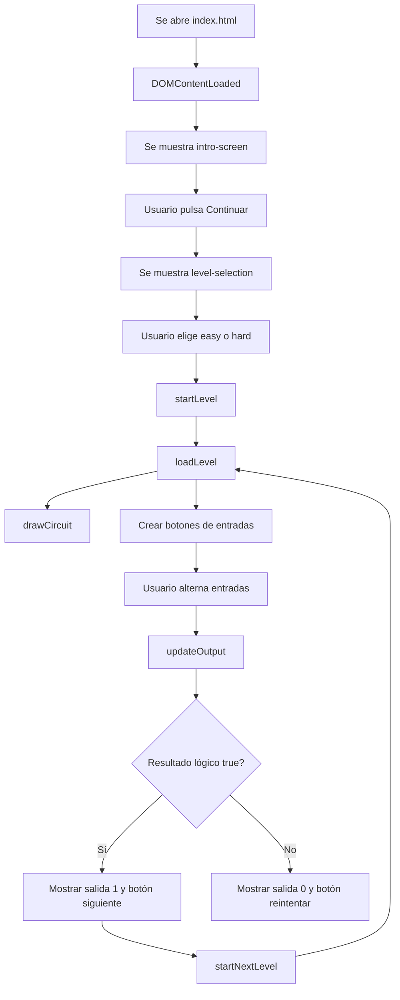

# Análisis del repositorio: Logic Gates Challenge Game

Este documento nació como análisis del baseline V1. Las secciones 1–19 describen el estado original del repositorio antes de la migración a V2 y se conservan como contexto histórico.

Estado actual tras Fase 10: la app pública es **Lógica Digital / Digital Logic Lab**, una SPA Vite + React + TypeScript desplegada en Vercel. GitHub Pages fue desactivado y los archivos legacy V1 (`Proyecto MD.js`, `styles.css`, `assets/`) se eliminaron del árbol principal.

## 1. Resumen ejecutivo histórico V1

`Logic Gates Challenge Game` es una aplicación web educativa, estática e interactiva para practicar compuertas lógicas digitales. El usuario selecciona una dificultad, activa o desactiva entradas binarias y observa si la salida del circuito lógico cambia a `1` o `0`.

El proyecto está implementado con tecnologías web básicas:

| Área | Tecnología |
| --- | --- |
| Estructura | HTML5 |
| Estilos | CSS3 |
| Lógica e interacción | JavaScript puro en navegador |
| Despliegue | GitHub Pages |
| Dependencias externas | Ninguna |

No existe backend, base de datos, framework frontend, empaquetador ni instalación previa. La app funciona abriendo `index.html` en el navegador o usando la demo publicada en GitHub Pages.

Demo pública documentada en el repo: `https://sam-24-dev.github.io/Logis-Gates-Challenge-Game/`

## 2. Qué se hizo

Se construyó un juego de una sola página para reforzar conceptos básicos de lógica digital. La aplicación guía al usuario por este flujo:

1. Muestra una pantalla de bienvenida.
2. Permite elegir dificultad: nivel bajo/fácil o nivel alto/difícil.
3. Carga el primer nivel de la dificultad elegida.
4. Renderiza entradas, compuertas y salida del circuito.
5. Permite alternar entradas binarias con botones.
6. Calcula la salida lógica en tiempo real.
7. Muestra feedback si la combinación produce la salida esperada.
8. Permite reintentar, avanzar al siguiente nivel o volver al menú.

El juego tiene 6 niveles en total:

| Dificultad | Cantidad | Contenido |
| --- | ---: | --- |
| Fácil | 4 | AND, OR, XOR, NAND |
| Difícil | 2 | Circuitos combinados con XOR, NOT, AND, NAND |

## 3. Alcance actual

### Incluido

- Pantalla inicial de bienvenida.
- Selección de dificultad.
- Sistema simple de niveles progresivos.
- Estados binarios para entradas `A`, `B`, `C` y `D`, según el nivel.
- Cálculo booleano de cada circuito.
- Diagrama visual generado dinámicamente con elementos HTML.
- LED visual de salida.
- Mensajes de feedback inmediatos.
- Botón para reintentar el nivel.
- Botón para avanzar al siguiente nivel.
- Botón para regresar al menú principal.
- Documentación pública en `README.md`.
- Assets visuales para README o presentación.

### No incluido todavía

- Persistencia de progreso.
- Puntuación.
- Temporizador.
- Tabla de verdad por nivel.
- Explicaciones teóricas dentro de cada nivel.
- Accesibilidad completa con teclado y atributos ARIA.
- Tests automatizados.
- Sistema de build o empaquetado.
- Separación modular de JavaScript.
- Backend o base de datos.

## 4. Estructura del repositorio

```text
Logis-Gates-Challenge-Game/
├── assets/
│   ├── difficulty.png
│   ├── overview.png
│   ├── prueba
│   └── welcome.png
├── documentation/
│   ├── baseline/
│   │   ├── phase0-baseline-desktop-level1-solved.png
│   │   ├── phase0-baseline-desktop-welcome.png
│   │   └── phase0-baseline-mobile-level1-solved.png
│   ├── repository-analysis.md
│   └── v2-product-implementation-plan.md
├── src/
│   ├── app/
│   │   ├── App.test.tsx
│   │   ├── App.tsx
│   │   └── appTypes.ts
│   ├── components/
│   ├── core/
│   ├── data/
│   ├── hooks/
│   ├── screens/
│   ├── state/
│   ├── styles/
│   │   └── baseline.css
│   ├── test/
│   │   ├── fixtures.ts
│   │   └── setup.ts
│   └── main.tsx
├── AGENTS.md
├── eslint.config.js
├── index.html
├── package-lock.json
├── package.json
├── Proyecto MD.js
├── README.md
├── styles.css
├── tsconfig.app.json
├── tsconfig.json
├── tsconfig.node.json
├── vite.config.ts
└── vitest.config.ts
```

## 5. Rol de cada archivo

| Archivo | Propósito |
| --- | --- |
| `index.html` | Define la estructura base de la página: bienvenida, selección de dificultad, contenedor del juego, botones, salida y carga del script. |
| `styles.css` | Controla la apariencia visual: layout centrado, colores, botones, estados ON/OFF, compuertas, líneas del circuito y salida. |
| `Proyecto MD.js` | Contiene todo el comportamiento del juego: estado, niveles, funciones de navegación, cálculo lógico, dibujo del circuito y actualización de UI. |
| `README.md` | Presenta el proyecto para usuarios externos: demo, features, tecnologías, estructura y futuras mejoras. |
| `assets/overview.png` | Imagen general del juego usada en el README. |
| `assets/welcome.png` | Captura de la pantalla de bienvenida. |
| `assets/difficulty.png` | Captura de la selección de dificultad. |
| `assets/prueba` | Archivo de texto con `#hola`; no se usa en la aplicación actual. |
| `documentation/repository-analysis.md` | Análisis del estado actual del repositorio y funcionamiento de la app V1. |
| `documentation/v2-product-implementation-plan.md` | Plan maestro aprobado para construir la V2 por fases. |
| `documentation/baseline/*.png` | Capturas baseline tomadas en Fase 0 para comparar la V1 contra la futura V2. |
| `AGENTS.md` | Guía operativa para futuras sesiones/agentes del proyecto. |
| `package.json` / `package-lock.json` | Tooling Vite/React/TypeScript/Vitest agregado en Fase 1. |
| `src/main.tsx` | Entrada React para Vite. |
| `src/app/App.tsx` | Implementación React baseline que conserva el flujo mínimo de la V1 mientras se prepara la arquitectura completa. |
| `src/app/App.test.tsx` | Tests de humo/interacción para validar bienvenida y nivel fácil 1. |
| `src/styles/baseline.css` | Estilos temporales cercanos a V1; el sistema visual real se trabajará en Fase 3. |
| `vite.config.ts` / `vitest.config.ts` / `tsconfig*.json` / `eslint.config.js` | Configuración profesional de build, test, tipos y lint. |

## 6. Flujo de ejecución



## 7. Cómo funciona el HTML

`index.html` contiene tres secciones principales:

| Sección | ID | Estado inicial | Función |
| --- | --- | --- | --- |
| Pantalla de introducción | `intro-screen` | Se muestra al cargar por JavaScript | Da la bienvenida y permite continuar. |
| Selección de nivel | `level-selection` | Oculta | Permite elegir dificultad fácil o difícil. |
| Contenedor del juego | `game-container` | Oculto | Muestra nivel, circuito, entradas, salida, feedback y navegación. |

La interacción se conecta usando atributos `onclick` en el HTML, por ejemplo:

- `showLevelSelection()` para pasar de bienvenida a menú.
- `startLevel('easy')` para iniciar dificultad fácil.
- `startLevel('hard')` para iniciar dificultad difícil.
- `retryLevel()` para reiniciar nivel.
- `startNextLevel()` para avanzar.
- `goBackToLevelSelection()` para volver al menú.

El archivo JavaScript se carga al final del body:

```html
<script src="Proyecto MD.js"></script>
```

Esto permite que el script encuentre los elementos del DOM ya declarados.

## 8. Cómo funciona el CSS

`styles.css` define un diseño simple y centrado:

- `body` usa `display: flex`, centra el contenido y ocupa `100vh`.
- `.intro-screen`, `.game-container` y `.level-selection` comparten tarjeta azul con padding, bordes redondeados y sombra.
- `.input-button`, `.level-button`, `.next-level-button` y `.retry-button` comparten estilos de botón.
- `.input-button.on` usa verde para representar entrada activa.
- `.input-button.off` usa rojo para representar entrada inactiva.
- `.output-led.on` usa verde para salida `1`.
- `.output-led.off` usa rojo para salida `0`.
- `.circuit-diagram` posiciona elementos del circuito dentro de un área relativa.
- `.circuit-gate`, `.circuit-line` y `.circuit-output` forman el diagrama visual.

El diagrama no usa SVG ni canvas. Se arma con `div`s posicionados absolutamente.

## 9. Cómo funciona el JavaScript

Todo el estado vive en variables globales dentro de `Proyecto MD.js`:

| Variable | Función |
| --- | --- |
| `currentLevel` | Guarda el número del nivel actual. |
| `difficulty` | Guarda la dificultad actual: `easy` o `hard`. |
| `inputStates` | Objeto con el estado booleano de cada entrada. |
| `levelCompleted` | Indica si el nivel actual ya fue completado. |
| `levels` | Define niveles, entradas, compuertas, lógica y mensajes. |

### Inicialización

Al cargar el DOM se muestra la pantalla inicial:

```js
document.addEventListener('DOMContentLoaded', () => {
    document.getElementById('intro-screen').style.display = 'block';
});
```

### Definición de niveles

Los niveles están declarados en el objeto `levels`. Cada nivel contiene:

- `title`: título visible del nivel.
- `inputs`: entradas disponibles.
- `gates`: compuertas que se dibujan.
- `logic`: función que calcula la salida.
- `feedbackCorrect`: mensaje cuando la salida es verdadera.
- `feedbackIncorrect`: mensaje cuando la salida es falsa.

Ejemplo del nivel fácil 1:

```js
logic: function() {
    return inputStates.A && inputStates.B;
}
```

## 10. Lógica implementada por nivel

| Dificultad | Nivel | Entradas | Compuertas | Expresión lógica |
| --- | ---: | --- | --- | --- |
| Fácil | 1 | `A`, `B` | AND | `A && B` |
| Fácil | 2 | `A`, `B` | OR | `A || B` |
| Fácil | 3 | `A`, `B` | XOR | `A !== B` |
| Fácil | 4 | `A`, `B` | NAND | `!(A && B)` |
| Difícil | 1 | `A`, `B`, `C` | XOR, NOT, AND | `(A !== B) && !C` |
| Difícil | 2 | `A`, `B`, `C`, `D` | AND, NAND, XOR | `(A && B) !== !(C && D)` |

Importante: el juego considera completado un nivel cuando la función `logic()` devuelve `true`. No compara contra una combinación única, sino contra cualquier combinación que produzca salida verdadera.

## 11. Renderizado del circuito

La función `drawCircuit(inputs, gates)` genera el circuito en el DOM cada vez que se carga un nivel.

Hace lo siguiente:

1. Calcula posiciones para las entradas.
2. Calcula posiciones para las compuertas.
3. Ajusta posiciones especiales según dificultad y nivel.
4. Crea `div`s para entradas.
5. Crea líneas horizontales como `div.circuit-line`.
6. Crea `div`s para compuertas.
7. Crea un círculo final `div#circuit-output` para la salida.

La implementación es visual y manual: las conexiones no representan una simulación física del circuito, sino una representación gráfica simple para apoyar el aprendizaje.

## 12. Navegación interna

| Función | Responsabilidad |
| --- | --- |
| `showLevelSelection()` | Oculta bienvenida y muestra selección de dificultad. |
| `startLevel(selectedDifficulty)` | Define dificultad, reinicia nivel a 1, muestra juego y carga nivel. |
| `loadLevel(level)` | Carga datos del nivel, limpia UI, dibuja circuito, crea botones y resetea salida. |
| `updateOutput()` | Calcula la lógica del nivel y actualiza salida, feedback y botones. |
| `drawCircuit(inputs, gates)` | Dibuja entradas, compuertas, líneas y salida del circuito. |
| `startNextLevel()` | Avanza si el nivel fue completado; si no hay más niveles, muestra alerta y vuelve al menú. |
| `retryLevel()` | Recarga el nivel actual. |
| `goBackToLevelSelection()` | Oculta juego y vuelve al menú de dificultad. |
| `toggleMenuButtonVisibility()` | Función auxiliar definida, pero actualmente no se usa en el flujo principal. |

## 13. Estado visual y feedback

Cuando el usuario pulsa una entrada:

1. Se invierte el valor booleano en `inputStates`.
2. Se cambia la clase del botón entre `input-button on` y `input-button off`.
3. Se ejecuta `updateOutput()`.
4. Se calcula la salida del nivel.
5. Se actualiza el LED textual `#output`.
6. Se actualiza el círculo visual `#circuit-output`.
7. Se muestra feedback correcto o incorrecto.
8. Se muestra el botón de avance o reintento.

## 14. Historial observado del repositorio

El historial reciente indica que el proyecto fue subido y luego documentado/mejorado en varias iteraciones. Commits recientes observados:

```text
046493d Update README.md
0ada852 Add files via upload
1605a7f Create prueba
02c2a97 Update README.md
154dc06 Update Proyecto MD.js
da0e3d0 Update README.md
28d7e96 Delete CNAME
42a4190 Create CNAME
3017722 Create README.md
1c4bd02 Add files via upload
```

Esto sugiere una evolución típica de proyecto educativo estático:

- Creación/subida inicial de archivos HTML, CSS y JS.
- Ajustes al HTML y JavaScript.
- Creación y actualización del README.
- Pruebas con GitHub Pages/CNAME.
- Agregado de imágenes para documentación.

## 15. Validaciones realizadas durante este análisis

Se revisó el repositorio con estas acciones:

- Lectura de `README.md`.
- Lectura de `index.html`.
- Lectura de `styles.css`.
- Lectura de `Proyecto MD.js`.
- Lectura de `assets/prueba`.
- Revisión de archivos versionados con Git.
- Revisión del historial reciente de commits.
- Validación sintáctica del JavaScript con:

```bash
node --check "Proyecto MD.js"
```

Resultado: no se reportaron errores de sintaxis.

También se abrió la demo pública en navegador y se comprobó el flujo básico:

1. Pantalla de bienvenida.
2. Botón `Continuar`.
3. Selección de dificultad.
4. Inicio de nivel fácil.
5. Activación de entradas `A` y `B`.
6. Salida `1` y feedback correcto en el nivel AND.

Observación menor: en la demo publicada aparece un error 404 para `favicon.ico`. No rompe la aplicación; solo indica que no existe favicon configurado.

## 16. Fortalezas del proyecto

- Muy fácil de ejecutar y entender.
- Sin dependencias externas.
- Buen enfoque educativo para conceptos de lógica digital.
- Separación básica entre HTML, CSS y JS.
- README claro con demo, capturas y explicación general.
- Los niveles están centralizados en un objeto, lo que facilita agregar nuevos desafíos.
- La lógica se actualiza en tiempo real y da feedback inmediato.

## 17. Limitaciones técnicas actuales

- El archivo `Proyecto MD.js` tiene un nombre con espacio; funciona, pero no es ideal para mantenimiento. Un nombre como `script.js` o `game.js` sería más estándar.
- La lógica, estado, renderizado y navegación están todos en un mismo archivo global.
- El HTML usa `onclick` inline; para escalar sería mejor usar `addEventListener` desde JavaScript.
- No hay tests automatizados para validar las expresiones lógicas.
- El dibujo del circuito depende de posiciones manuales por nivel.
- La app no guarda progreso.
- No hay soporte completo para navegación por teclado.
- No hay favicon, lo que produce un 404 menor en navegador.
- `assets/prueba` parece un archivo de prueba sin uso.

## 18. Cómo extender el proyecto

### Agregar un nivel fácil

Agregar una nueva entrada dentro de `levels.easy` en `Proyecto MD.js`:

```js
5: {
    title: "Nivel Bajo - Nivel 5",
    inputs: ['A', 'B'],
    gates: ['NOR'],
    logic: function() {
        return !(inputStates.A || inputStates.B);
    },
    feedbackCorrect: "¡Correcto! La compuerta NOR produce 1 cuando A y B están apagadas.",
    feedbackIncorrect: "La combinación no es correcta."
}
```

Luego habría que confirmar que `drawCircuit()` posiciona bien la nueva compuerta.

### Agregar una explicación educativa

Se podría extender cada nivel con una propiedad nueva:

```js
explanation: "AND produce 1 solo cuando ambas entradas son 1."
```

Y luego renderizarla en `loadLevel()` dentro de un nuevo contenedor HTML.

### Agregar tablas de verdad

Como cada nivel ya declara `inputs` y `logic`, se podría generar automáticamente la tabla de verdad iterando todas las combinaciones posibles de entradas.

## 19. Recomendaciones priorizadas

| Prioridad | Recomendación | Motivo |
| --- | --- | --- |
| Alta | Renombrar `Proyecto MD.js` a `game.js` o `script.js` | Mejora mantenibilidad y evita espacios en rutas. |
| Alta | Agregar pruebas simples para la lógica de niveles | Evita regresiones al agregar más compuertas. |
| Media | Separar datos de niveles de funciones de UI | Facilita crecer el juego. |
| Media | Agregar tablas de verdad o explicación por nivel | Aumenta valor educativo. |
| Media | Mejorar accesibilidad con teclado y ARIA | Hace el juego más usable. |
| Baja | Agregar favicon | Elimina el 404 menor en consola. |
| Baja | Eliminar o documentar `assets/prueba` | Limpia archivos sin uso. |

## 20. Estado tras Fase 1 de V2

La Fase 1 agregó tooling profesional sin ejecutar todavía el rediseño visual completo:

- Vite + React + TypeScript.
- Vitest + Testing Library.
- ESLint flat config.
- Estructura base `src/` para futuras fases.
- Entrada Vite en `index.html` y `src/main.tsx`.
- Implementación React baseline en `src/app/App.tsx`.
- Tests de humo/interacción para proteger el flujo inicial.

Importante: la separación formal entre datos, lógica pura y UI queda para Fase 2. Por eso los niveles viven temporalmente en `App.tsx` como puente de migración.

## 21. Estado tras Fase 2 de V2

La Fase 2 completó la separación entre UI, datos y lógica pura:

- `src/core/gameTypes.ts` define contratos TypeScript para dificultades, entradas, compuertas, circuitos, niveles y truth tables.
- `src/data/gates.ts` centraliza metadatos de compuertas y número de entradas esperado.
- `src/data/levels.ts` contiene los 6 niveles originales migrados a un modelo declarativo de circuitos.
- `src/core/evaluateGate.ts` evalúa AND/OR/XOR/NAND/NOT sin React ni DOM.
- `src/core/evaluateCircuit.ts` evalúa árboles de circuito a partir de estados de entrada.
- `src/core/truthTable.ts` genera automáticamente todas las combinaciones de entrada y salida.
- `src/core/scoring.ts` agrega una fórmula inicial simple para futuras fases de modo reto/progreso.
- `src/app/App.tsx` consume `levelsByDifficulty` y `evaluateCircuit`, por lo que la UI ya no contiene funciones lógicas inline por nivel.
- La suite de tests protege gates, circuitos, truth tables, niveles, scoring y el flujo UI baseline.

Esto deja el proyecto preparado para Fase 3, donde se trabajará el sistema visual y layout base sin volver a mezclar lógica de juego con presentación.

## 22. Estado tras Fase 3 de V2

La Fase 3 introdujo el sistema visual base de la V2:

- `src/styles/baseline.css` fue reemplazado por módulos CSS especializados: `tokens.css`, `base.css`, `layout.css` y `components.css`.
- `src/styles/tokens.css` concentra paleta, tipografías, spacing, radius, sombras, borders y tiempos de motion.
- `src/styles/base.css` define reset base, fondo global, grilla técnica, scanlines sutiles, selección, foco visible y reduced motion.
- `src/styles/layout.css` define el shell visual y paneles de laboratorio responsive.
- `src/styles/components.css` define botones, estados ON/OFF, diagrama temporal de circuito, LED de salida y feedback.
- `src/app/App.tsx` mantiene la lógica de Fase 2, pero ahora tiene estructura semántica y clases para la identidad V2.
- El layout fue validado en 375px, 768px, 1024px y 1440px sin overflow horizontal.

La identidad visual actual ya se aleja de la V1 básica y de una plantilla SaaS genérica, pero las pantallas siguen siendo el flujo simple heredado. La Fase 4 debe convertir ese flujo en pantallas principales completas.

## 23. Conclusión histórica

El repositorio nació como un juego educativo funcional y liviano para practicar compuertas lógicas con HTML, CSS y JavaScript puro. Ese baseline permitió validar rápidamente la idea.

Con Fase 1, el proyecto obtuvo tooling moderno. Con Fase 2, ya tiene un modelo de datos y lógica pura testeable. Con Fase 3, la app tiene una base visual responsive y distintiva para construir una V2 profesional sin romper el comportamiento lógico base.

## 24. Estado final tras Fase 10 de V2

La V2 completa transforma el repositorio en **Lógica Digital / Digital Logic Lab**:

- Stack actual: Vite, React, TypeScript, Vitest, ESLint y CSS modular propio.
- UI actual: laboratorio digital retro-futurista con `WelcomeScreen`, selección de modo, nivel interactivo y resultados.
- Circuitos: renderizados con SVG en `src/components/CircuitBoard/CircuitBoard.tsx`.
- Lógica: separada de React en `src/core/` y `src/data/`, con tests unitarios.
- Modos: práctica guiada con tabla de verdad y feedback educativo; reto con timer, score, racha y progreso.
- Persistencia: progreso liviano con `localStorage` versionado en `src/core/progress.ts`.
- Deploy oficial: Vercel en `https://logis-gates-challenge-game.vercel.app/`.
- GitHub Pages: desactivado para evitar dos versiones públicas.
- Legacy V1: `Proyecto MD.js`, `styles.css` y `assets/` fueron eliminados del producto final.
- QA final: Lighthouse local `Performance 90`, `Accessibility 100`, `Best Practices 100`, `SEO 100`; tests/lint/build/audit pasan.